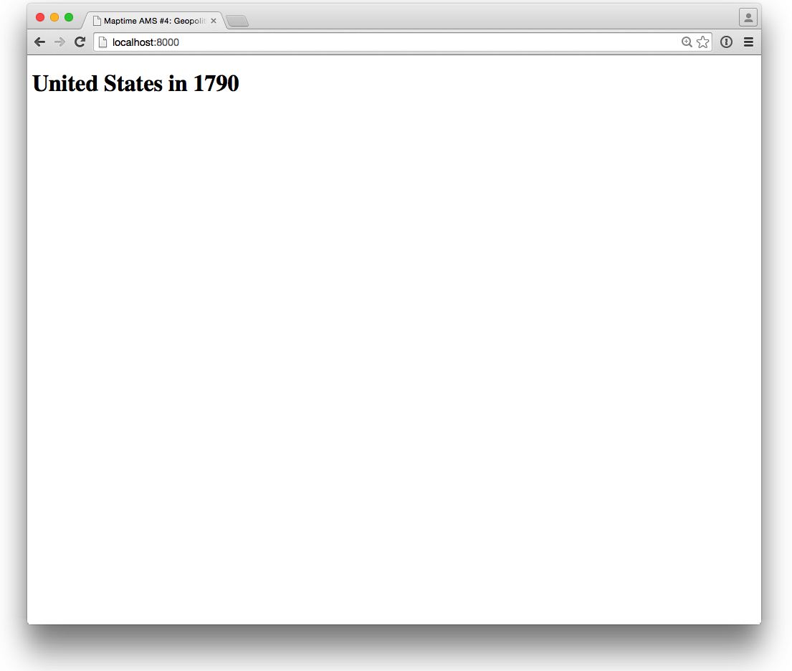
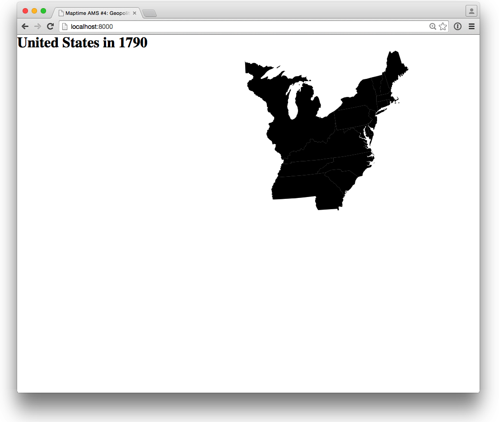
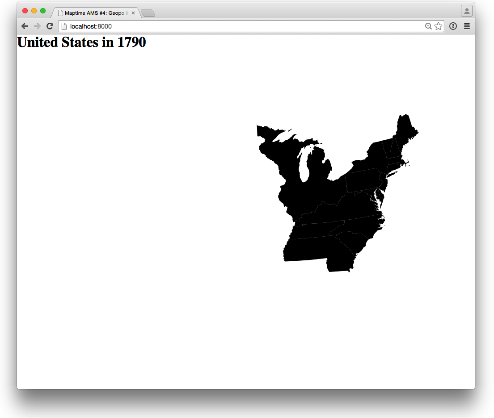
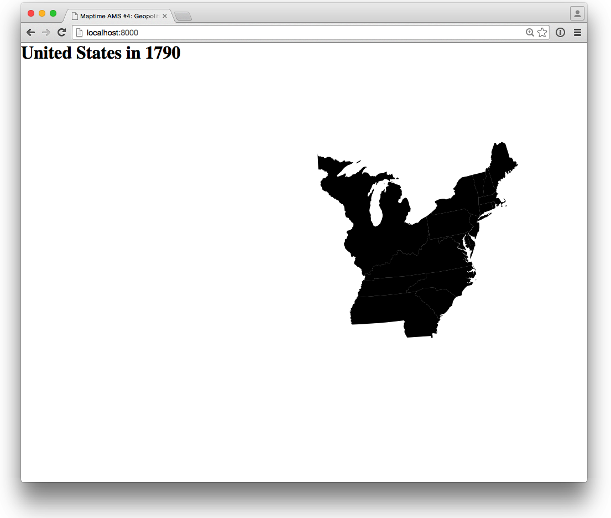
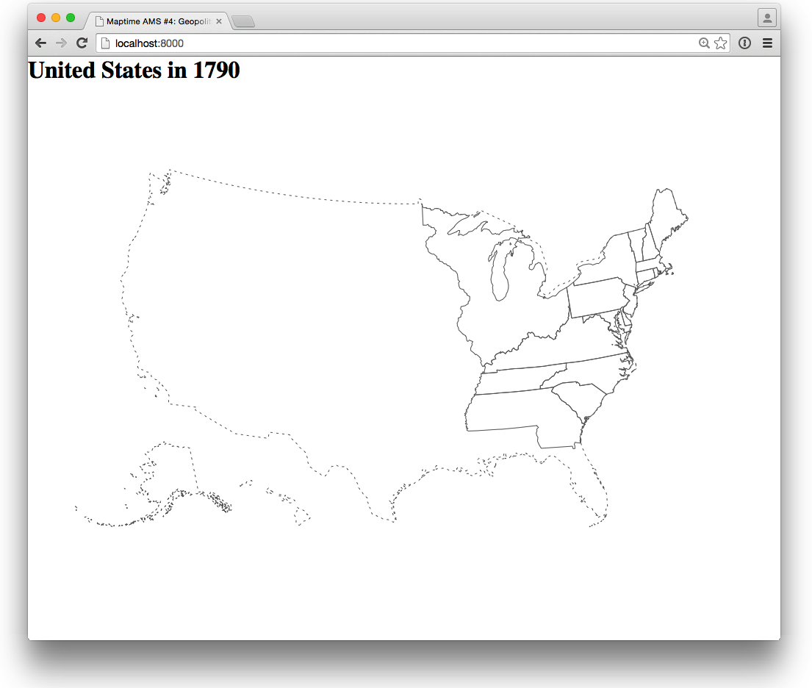
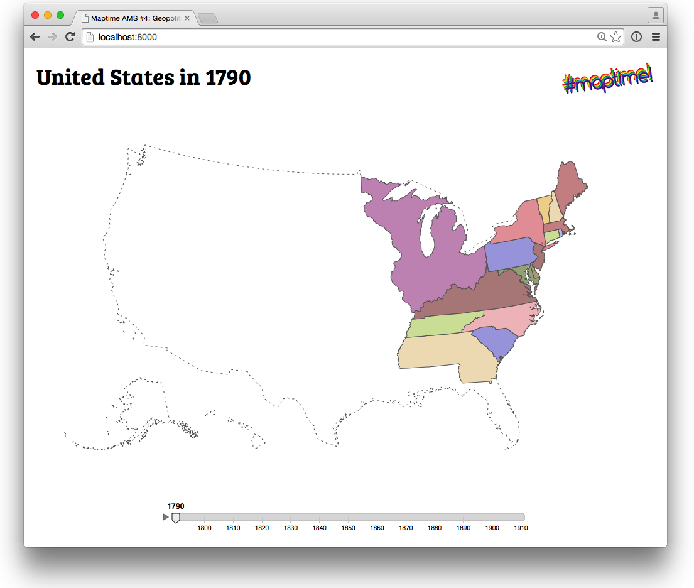

# D3.js - animated U.S. states border map

## Step 0: Data

## Step 1: Empty website

After this step, your map should look like this:

- [Source code](tutorial/1/index.html)
- [View in browser](http://maptime-ams.github.io/animated-borders-d3js/tutorial/1)
- Screenshot (nice & empty!):

## Step 2: Title and header

After this step, your map should look like this:

- [Source code](tutorial/2/index.html)
- [View in browser](http://maptime-ams.github.io/animated-borders-d3js/tutorial/2)
- Screenshot:

## Step 3: A map! With D3.js!

After this step, your map should look like this:

- [Source code](tutorial/3/index.html)
- [View in browser](http://maptime-ams.github.io/animated-borders-d3js/tutorial/3)
- Screenshot:

## Step 4: Scale & position map in browser's center

After this step, your map should look like this:

- [Source code](tutorial/4/index.html)
- [View in browser](http://maptime-ams.github.io/animated-borders-d3js/tutorial/4)
- Screenshot:

## Step 5: Load all states for all years (1790 - 1910)

After this step, your map should look like this:

- [Source code](tutorial/5/index.html)
- [View in browser](http://maptime-ams.github.io/animated-borders-d3js/tutorial/5)
- Screenshot:

## Step 6: `update()` function

After this step, your map should look like this:

- [Source code](tutorial/6/index.html)
- [View in browser](http://maptime-ams.github.io/animated-borders-d3js/tutorial/6)
- Screenshot:

## Step 7: SVG style for US states

After this step, your map should look like this:

- [Source code](tutorial/7/index.html)
- [View in browser](http://maptime-ams.github.io/animated-borders-d3js/tutorial/7)
- Screenshot:

## Step 8: Dashed USA coastline

After this step, your map should look like this:

- [Source code](tutorial/8/index.html)
- [View in browser](http://maptime-ams.github.io/animated-borders-d3js/tutorial/8)
- Screenshot:

## Step 9: Nice font, and a Maptime logo

After this step, your map should look like this:

- [Source code](tutorial/9/index.html)
- [View in browser](http://maptime-ams.github.io/animated-borders-d3js/tutorial/9)
- Screenshot:

## Step 10: Colors, colors, colors!

After this step, your map should look like this:

- [Source code](tutorial/10/index.html)
- [View in browser](http://maptime-ams.github.io/animated-borders-d3js/tutorial/10)
- Screenshot:

## Step 11: State name tooltips

After this step, your map should look like this:

- [Source code](tutorial/11/index.html)
- [View in browser](http://maptime-ams.github.io/animated-borders-d3js/tutorial/11)
- Screenshot:

## Step 12: Time slider

After this step, your map should look like this:

- [Source code](tutorial/12/index.html)
- [View in browser](http://maptime-ams.github.io/animated-borders-d3js/tutorial/12)
- Screenshot:

## Step 13: Animation!

After this step, your map should look like this:

- [Source code](tutorial/13/index.html)
- [View in browser](http://maptime-ams.github.io/animated-borders-d3js/tutorial/13)
- Screenshot:

## Step 14: Done!

Congratulations, you've made a map with D3.js! Now, go and make another one! Or, make this one a bit better. Some ideas:

- Nicer colors. You could make older or more Eastern states darker, for example.
- Resize the map when the [browser resizes](https://developer.mozilla.org/en-US/docs/Web/API/Window.onresize).
- Use JavaScript to make better functioning state name tooltips.
- Add cities and places. [Natural Earth](http://www.naturalearthdata.com/downloads/10m-cultural-vectors/10m-populated-places/) has some great open data sets available, and you could try to use [Turf](http://turfjs.org/static/docs/)'s [`turf.inside`](http://turfjs.org/static/docs/module-turf_inside.html) function to only display cities in visible states.
- Tell stories! Highlight certain periods and locations, and tell viewers what happened on those moments in time.
