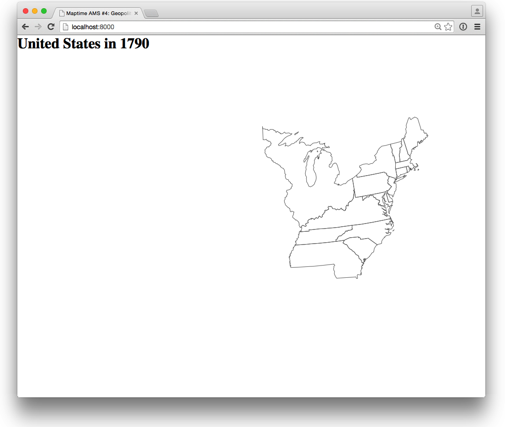
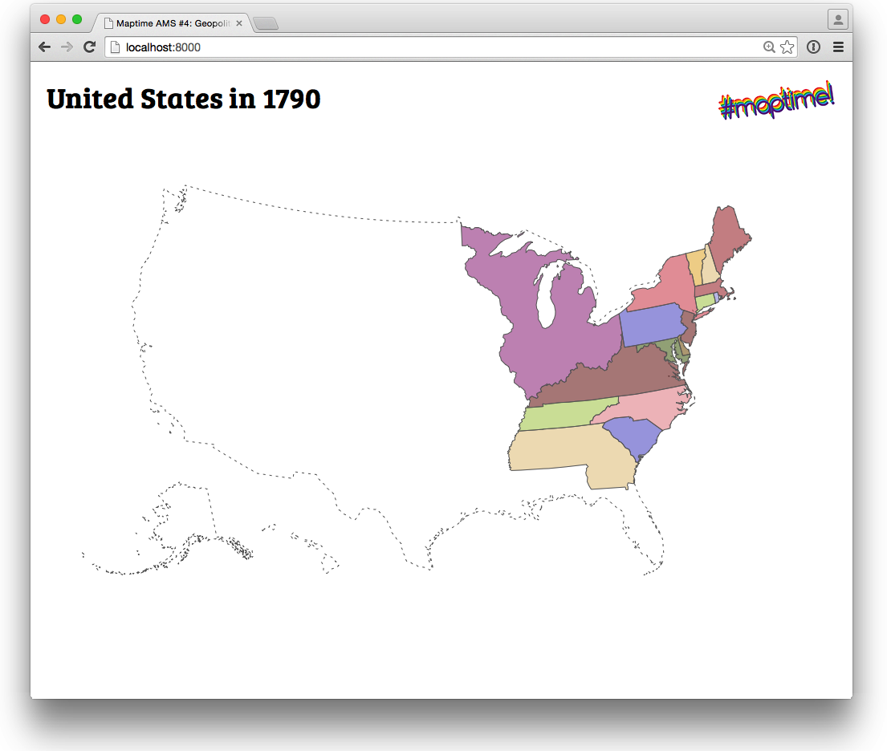

# Animated U.S. states border map with D3.js

## Step 0: Data

## Step 1:

After this step, your map should look like this:

- [Source code](tutorial/1/index.html)
- [View in browser](http://maptime-ams.github.io/animated-borders-d3js/tutorial/1)
- Screenshot:

## Step 2:

After this step, your map should look like this:

- [Source code](tutorial/2/index.html)
- [View in browser](http://maptime-ams.github.io/animated-borders-d3js/tutorial/2)
- Screenshot:

## Step 3:

After this step, your map should look like this:

- [Source code](tutorial/3/index.html)
- [View in browser](http://maptime-ams.github.io/animated-borders-d3js/tutorial/3)
- Screenshot:

## Step 4:

After this step, your map should look like this:

- [Source code](tutorial/4/index.html)
- [View in browser](http://maptime-ams.github.io/animated-borders-d3js/tutorial/4)
- Screenshot:

## Step 5:

After this step, your map should look like this:

- [Source code](tutorial/5/index.html)
- [View in browser](http://maptime-ams.github.io/animated-borders-d3js/tutorial/5)
- Screenshot:

## Step 6:

After this step, your map should look like this:

- [Source code](tutorial/6/index.html)
- [View in browser](http://maptime-ams.github.io/animated-borders-d3js/tutorial/6)
- Screenshot:

## Step 7:

After this step, your map should look like this:

- [Source code](tutorial/7/index.html)
- [View in browser](http://maptime-ams.github.io/animated-borders-d3js/tutorial/7)
- Screenshot:

## Step 8:

After this step, your map should look like this:

- [Source code](tutorial/8/index.html)
- [View in browser](http://maptime-ams.github.io/animated-borders-d3js/tutorial/8)
- Screenshot:

## Step 9:

After this step, your map should look like this:

- [Source code](tutorial/9/index.html)
- [View in browser](http://maptime-ams.github.io/animated-borders-d3js/tutorial/9)
- Screenshot:

## Step 10:

After this step, your map should look like this:

- [Source code](tutorial/10/index.html)
- [View in browser](http://maptime-ams.github.io/animated-borders-d3js/tutorial/10)
- Screenshot:

## Step 11:

After this step, your map should look like this:

- [Source code](tutorial/11/index.html)
- [View in browser](http://maptime-ams.github.io/animated-borders-d3js/tutorial/11)
- Screenshot:

## Step 12:

After this step, your map should look like this:

- [Source code](tutorial/12/index.html)
- [View in browser](http://maptime-ams.github.io/animated-borders-d3js/tutorial/12)
- Screenshot:

## Step 13:

After this step, your map should look like this:

- [Source code](tutorial/13/index.html)
- [View in browser](http://maptime-ams.github.io/animated-borders-d3js/tutorial/13)
- Screenshot:

